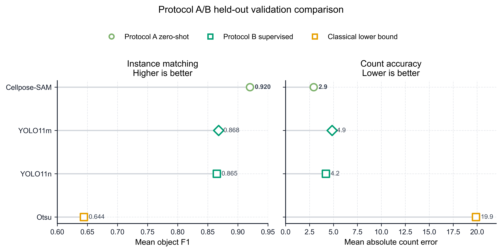
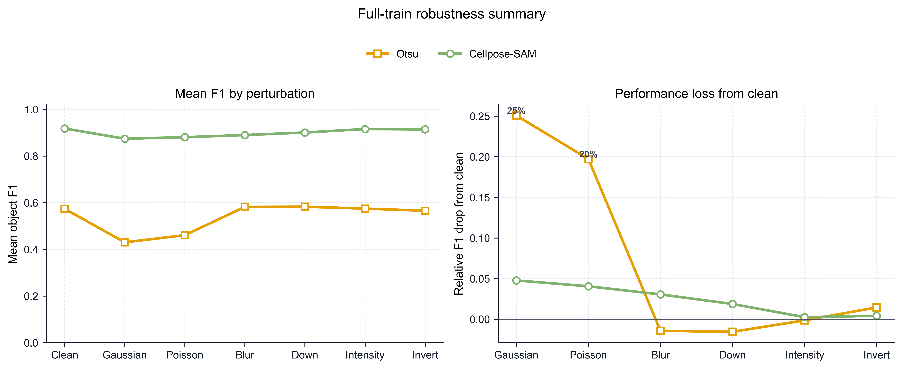
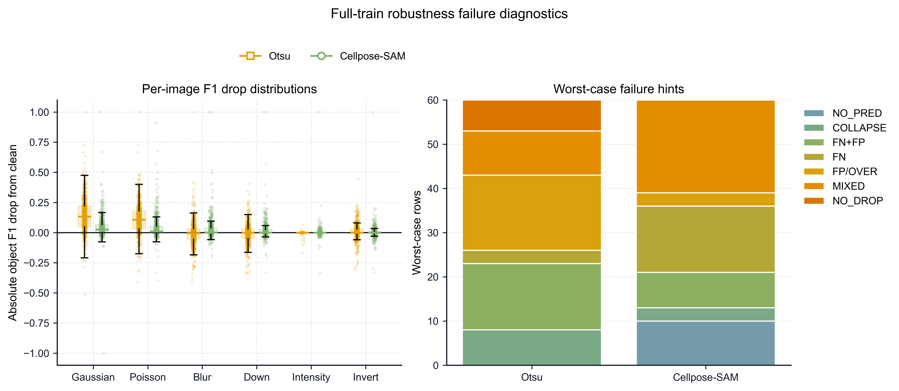
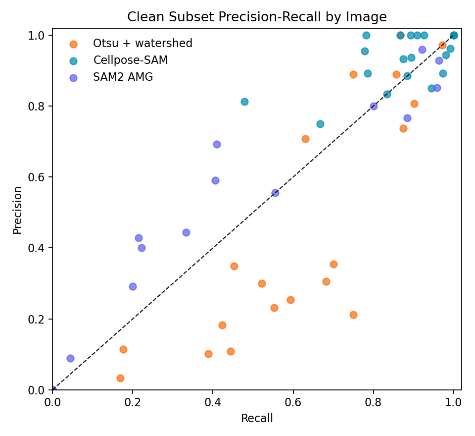
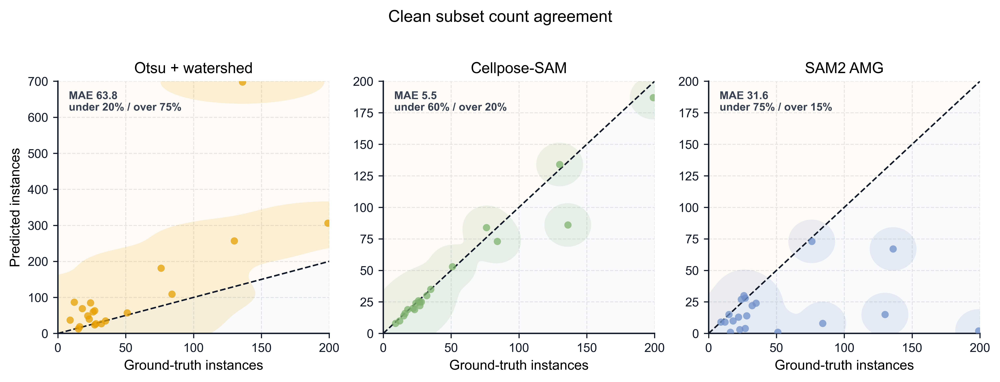

# cellseg-robustness-diagnostic


A reproducible benchmark for microscopy cell instance segmentation. The main track
evaluates zero-shot and out-of-the-box robustness on DSB2018; a separate supervised
track evaluates YOLO-seg fine-tuning with the same repository metrics.

## Contents

- [Key Results](#key-results)
- [Main Figures](#main-figures)
- [Benchmark Design](#benchmark-design)
- [Methods](#methods)
- [Metrics](#metrics)
- [Repository Layout](#repository-layout)
- [Reproduce](#reproduce)
- [Documentation](#documentation)
- [Related Work](#related-work)
- [Limitations and Follow-up Work](#limitations-and-follow-up-work)

## Key Results

**Cellpose-SAM / `cpsam` is the strongest zero-shot baseline in this
repository.** It keeps high object-level F1 across the tested full-train
perturbations. Otsu + watershed remains useful as an interpretable classical lower
bound. SAM2 automatic mask generation is not reliable enough under the current
no-prompt AMG protocol for the main robustness comparison.

Full `stage1_train` zero-shot F1:

| Method | Clean | Noise | Poisson | Blur | Down | Scale | Invert |
| --- | ---: | ---: | ---: | ---: | ---: | ---: | ---: |
| Cellpose-SAM | 0.9178 | 0.8740 | 0.8806 | 0.8898 | 0.9006 | 0.9155 | 0.9139 |
| Otsu + watershed | 0.5736 | 0.4298 | 0.4606 | 0.5818 | 0.5825 | 0.5744 | 0.5653 |

Same 134-image held-out validation split, including supervised YOLO-seg models:

| Method | Protocol | Train | F1 | Count error |
| --- | --- | ---: | ---: | ---: |
| Cellpose-SAM | zero-shot | 0 | 0.9200 | 2.9328 |
| YOLO11m | supervised | 536 | 0.8680 | 4.8582 |
| YOLO11n | supervised | 536 | 0.8649 | 4.2090 |
| Otsu + watershed | zero-shot | 0 | 0.6442 | 19.8806 |

Interpretation:

- Cellpose-SAM is the strongest zero-shot baseline in this benchmark.
- Otsu + watershed provides a transparent lower bound and exposes noise-driven
  count inflation.
- SAM2 AMG mainly fails through automatic-mask-generation behavior on dense
  microscopy images; this is not a language-prompt failure.
- YOLO-seg substantially improves over Otsu + watershed, but the tested supervised
  models do not match Cellpose-SAM under this evaluation protocol.

## Main Figures

### Protocol A/B Held-out Validation



*Figure 1. Held-out validation comparison between zero-shot baselines and supervised YOLO-seg models.*

### Full-train Robustness



*Figure 2. Full-train robustness summary for Cellpose-SAM and Otsu + watershed across tested perturbations.*

### Failure Diagnostics



*Figure 3. Failure diagnostics for the full-train robustness run.*

### Clean-subset Baseline Behavior



*Figure 4. Clean-subset precision-recall behavior across baseline methods.*



*Figure 5. Clean-subset count agreement between true and predicted instance counts.*

## Benchmark Design

| Protocol | Status |
| --- | --- |
| A. Zero-shot robustness | Completed |
| B. Supervised adaptation | Complete through YOLO11m |
| C. VLM output validity | Separate follow-up protocol |

Protocol A asks which methods work without target labels or manual prompts.
Protocol B asks how much YOLO fine-tuning helps. Protocol C covers a separate
mask-output VLM validity study.

The project keeps zero-shot, supervised, and VLM-style segmentation separate. Their
assumptions differ, so the README reports them as related protocols rather than a
single undifferentiated ranking.

## Methods

### Protocol A

| Method | Role | Assumption |
| --- | --- | --- |
| Otsu + watershed | Classical lower bound | Fixed image-processing pipeline |
| Cellpose-SAM / `cpsam` | Bio-adapted baseline | Cellpose 4.x Cellpose-SAM workflow |
| SAM2 AMG | General foundation-model screen | Automatic grid prompts only |

Legacy Cellpose3 `cyto3` and one-click restoration are not included in the reported
main comparison. The current `cell` environment uses `cellpose==4.1.1`, where the
Cellpose-family baseline is `cpsam`.

### Protocol B

YOLO-seg is trained as a supervised real-time segmentation baseline. The current
diagnostics include:

- label-conversion smoke test;
- tiny training and evaluation smoke tests;
- fixed-budget 100-image baseline;
- threshold diagnostic;
- nested label-budget diagnostic at 100, 250, and 536 train-pool images;
- YOLO11m full-train-pool capacity diagnostic.

### Perturbations

| Perturbation | Purpose |
| --- | --- |
| Gaussian noise | Sensor or acquisition noise |
| Poisson noise | Shot-noise-like intensity noise |
| Gaussian blur | Defocus or optical blur |
| Downsample then upsample | Undersampling stress |
| Intensity scaling | Underexposure or overexposure |
| Contrast inversion | Intensity-convention change |

Channel swap and object-scale perturbations are documented separately and are not
part of the reported results.

## Metrics

The main comparison uses repository-native instance metrics rather than each model's
native training logs.

| Metric | Purpose |
| --- | --- |
| Object-level F1 | Main instance detection metric |
| Precision / recall | False-positive and missed-object behavior |
| Mean matched IoU / Dice | Mask overlap quality for matched instances |
| Absolute count error | Cell-count reliability |
| Missed-object rate | False-negative tendency |
| FP per true instance | Spurious-instance burden |
| Count bias | Over-counting or under-counting direction |
| Latency | Practical runtime cost |

Over-segmentation and under-segmentation are summarized through failure-case hints
and count-bias diagnostics. A stricter split/merge graph metric is not included in
the reported results.

## Repository Layout

- [src/](src/): shared loading, evaluation, perturbation, plotting, and visualization code.
- [scripts/](scripts/): experiment, evaluation, analysis, and redraw entrypoints.
- [results/dataset/](results/dataset/): dataset audit outputs.
- [results/baselines/](results/baselines/): clean-subset baseline metrics and comparisons.
- [results/robustness/](results/robustness/): robustness summaries, image deltas, and failure cases.
- [results/supervised/](results/supervised/): YOLO conversion, metadata, evaluation, and comparisons.
- [figures/](figures/): flat PNG figure outputs.
- [docs/](docs/): protocol, environment, data, output, and findings documentation.
- [model_assets/](model_assets/): local model weights, ignored by git.
- [data/](data/): local DSB2018 data, ignored by git.

## Reproduce

Environment setup is documented in [docs/environment.md](docs/environment.md);
dataset source and local layout are documented in [docs/data.md](docs/data.md). The
environment is a conda environment named `cell` with Cellpose-SAM, SAM2,
Ultralytics YOLO, PyTorch, and the repository image-analysis stack installed.

Representative entrypoints:

```bash
python scripts/audit_dataset.py
python scripts/compare_baseline_subset.py
python scripts/run_pow_robustness_smoke.py --output-tag full_train --methods otsu_watershed cellpose_cpsam
python scripts/analyze_pow_robustness_full_train.py
python scripts/summarize_yolo_capacity_diagnostic.py
python scripts/redraw_publication_figures.py
```

The exact environment, data placement, model weights, and long-running experiment
notes are in [docs/](docs/) rather than repeated in the README.

## Documentation

- [technical_memo.md](technical_memo.md): result memo and interpretation.
- [docs/pow_report.md](docs/pow_report.md): zero-shot stage report.
- [docs/pow_findings.md](docs/pow_findings.md): method ranking, robustness, and failure modes.
- [docs/supervised_protocol.md](docs/supervised_protocol.md): YOLO supervised protocol and results.
- [docs/failure_taxonomy.md](docs/failure_taxonomy.md): failure-case taxonomy.
- [docs/output_contract.md](docs/output_contract.md): result and figure organization.
- [docs/experiment_plan.md](docs/experiment_plan.md): protocol plan and execution record.
- [docs/environment.md](docs/environment.md): environment setup.
- [docs/data.md](docs/data.md): dataset source and local structure.

## Related Work

Cellpose and Cellpose-SAM:

- [Cellpose GitHub repository](https://github.com/MouseLand/cellpose)
- [Cellpose3: one-click image restoration for improved cellular segmentation](https://www.nature.com/articles/s41592-025-02595-5)
- [Cellpose image restoration documentation](https://cellpose.readthedocs.io/en/latest/restore.html)
- [Cellpose-SAM: superhuman generalization for cellular segmentation](https://www.biorxiv.org/content/10.1101/2025.04.28.651001v1)
- [Cellpose documentation](https://cellpose.readthedocs.io/)

SAM, SAM2, and microscopy foundation models:

- [Segment Anything](https://segment-anything.com/)
- [Segment Anything paper](https://arxiv.org/abs/2304.02643)
- [SAM 2 paper](https://arxiv.org/abs/2408.00714)
- [SAM2 GitHub repository](https://github.com/facebookresearch/sam2)
- [SAM2 automatic mask generator example](https://github.com/facebookresearch/sam2/blob/main/notebooks/automatic_mask_generator_example.ipynb)
- [Revisiting foundation models for cell instance segmentation](https://openreview.net/forum?id=xFO3DFZN45)
- [Segment Anything for Microscopy](https://www.nature.com/articles/s41592-024-02580-4)
- [CellSAM: a foundation model for cell segmentation](https://www.nature.com/articles/s41592-025-02879-w)

Supervised, VLM, and classical references:

- [Ultralytics YOLO segmentation documentation](https://docs.ultralytics.com/tasks/segment/)
- [Ultralytics YOLO11 documentation](https://docs.ultralytics.com/models/yolo11/)
- [Conversational image segmentation with Gemini 2.5](https://developers.googleblog.com/conversational-image-segmentation-gemini-2-5/)
- [Gemini image understanding documentation](https://ai.google.dev/gemini-api/docs/image-understanding)
- [scikit-image watershed example](https://scikit-image.org/docs/stable/auto_examples/segmentation/plot_watershed.html)
- [CellProfiler IdentifyPrimaryObjects documentation](https://cellprofiler-manual.s3.amazonaws.com/CPmanual/IdentifyPrimaryObjects.html)

## Limitations and Follow-up Work

- The main zero-shot evidence is based on DSB2018 stage 1 train images and a compact
  perturbation set.
- SAM2 is tested in automatic mask generation mode only; prompted SAM2 and
  post-processing repair require separate experiments.
- Legacy Cellpose3 `cyto3` and restoration workflows are optional cross-version
  baselines, not part of the reported main comparison.
- The completed YOLO diagnostics do not close the gap to Cellpose-SAM. Additional
  YOLO work belongs in post-processing or architecture analysis.
- VLM mask-output validity remains a separate exploratory protocol.

## Disclaimer

This repository is a research benchmark project. It is not intended for clinical
use, biological decision-making, or production deployment.
