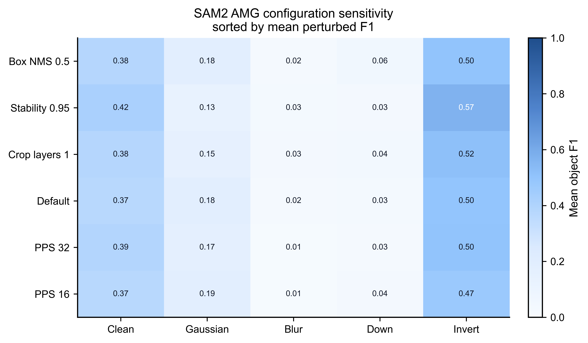

# Zero-shot Results Report

## Scope

This report is the auditable record for the completed zero-shot comparison on the
Kaggle 2018 Data Science Bowl dataset. It covers Otsu + watershed and Cellpose-SAM
on all 670 `stage1_train` images, plus SAM2 automatic mask generation (AMG) and a
fixed-concept SAM3 screen on the fixed 20-image subset. Supervised YOLO-seg results
are reported separately in [supervised_protocol.md](supervised_protocol.md).

The reported perturbations are Gaussian noise, Poisson noise, Gaussian blur,
downsample/upsample, intensity scaling, and contrast inversion. This report does not
evaluate prompted SAM2, legacy Cellpose3, Cellpose restoration, or generative mask
output.

## Primary Evidence

| Artifact | Role |
| --- | --- |
| [Full-train summary](../results/robustness/pow_baseline_robustness_full_train_summary.csv) | Aggregate metric evidence for Otsu and Cellpose-SAM |
| [Full-train per-image deltas](../results/robustness/pow_baseline_robustness_full_train_image_deltas.csv) | Clean-to-perturbation change by image |
| [Full-train failure cases](../results/robustness/pow_baseline_robustness_full_train_failure_cases.csv) | Largest observed degradations |
| [No-prediction cases](../results/robustness/pow_baseline_robustness_full_train_no_prediction_cases.csv) | Cellpose-SAM empty-prediction events |
| [SAM2 sensitivity validation](../results/robustness/sam2_amg_sensitivity_clean20_validation_summary.csv) | AMG configuration comparison on 20 images |
| [SAM3 clean20 gate summary](../results/baselines/sam3_prompted_concept_clean_subset_screen_summary.csv) | Fixed-concept expansion decision |

The accompanying figures are the [full-train summary](../figures/robustness_pow_full_train_summary.png),
[failure diagnostics](../figures/robustness_pow_full_train_failure_diagnostics.png),
and [SAM2 AMG sensitivity view](../figures/robustness_sam2_amg_sensitivity_clean20_mean_f1.png).

## Full-train Robustness

| Method | Clean | Gaussian | Poisson | Blur | Downsample | Intensity | Inversion |
| --- | ---: | ---: | ---: | ---: | ---: | ---: | ---: |
| Cellpose-SAM | 0.9178 | 0.8740 | 0.8806 | 0.8898 | 0.9006 | 0.9155 | 0.9139 |
| Otsu + watershed | 0.5736 | 0.4298 | 0.4606 | 0.5818 | 0.5825 | 0.5744 | 0.5653 |

*Mean object-level F1 across all 670 images for each condition.*

Cellpose-SAM has the highest clean score and the smallest degradation under every
tested perturbation. Its largest relative F1 decrease is 4.8% under Gaussian noise.
Otsu + watershed is most sensitive to noise: Gaussian noise decreases F1 by 25.1%
and Poisson noise by 19.7% relative to its clean score.

## SAM2 AMG Screening

| Configuration | Clean | Gaussian | Blur | Downsample | Inversion |
| --- | ---: | ---: | ---: | ---: | ---: |
| `stability_score_thresh_0.95` | 0.4190 | 0.1252 | 0.0286 | 0.0313 | 0.5676 |
| `points_per_side_32` | 0.3894 | 0.1700 | 0.0145 | 0.0272 | 0.5021 |
| `default_current` | 0.3683 | 0.1799 | 0.0213 | 0.0310 | 0.4996 |

*Mean object-level F1 on the fixed 20-image subset. The detailed validation table
also includes Poisson noise and intensity scaling.*

AMG did not fail mainly by returning no masks: the sensitivity validation had zero
no-prediction rows across 600 image-condition rows. Instead, its automatically
generated masks were poorly aligned with cell instances under Gaussian noise, blur,
and downsampling. The test uses automatic grid prompts, so this is not evidence about
language prompting.

*SAM2 AMG object F1 on the fixed 20-image sensitivity evaluation. The matrix makes
the shared blur and downsampling failure pattern visible across the tested settings.*

## SAM3 Fixed-Concept Screen

SAM3 received the fixed task-level text concept `"nucleus"`, with no image-specific
point, box, mask, or exemplar prompt. The locked configuration completed clean20 but
returned zero retained masks on every image (mean object F1 `0.0000`). Its paired
mean F1 difference from Otsu was `-0.4685` with a 95% bootstrap CI of
`[-0.5992, -0.3368]`.

This crossed two predeclared stop conditions: at least 50% zero-prediction images
and an Otsu-comparison CI whose upper bound is below zero. The protocol therefore
did not proceed to full_train or robustness, and this screen is not part of the
full-train ranking. It is evidence about this fixed SAM3 concept configuration, not
about all possible SAM3 prompts or adaptations.

## Failure Evidence

Otsu + watershed shows false positives, over-segmentation hints, and positive count
bias under noise. Cellpose-SAM's remaining failures are predominantly missed
instances and 14 empty-prediction rows out of 4,690 image-condition rows. The
[failure taxonomy](failure_taxonomy.md) defines these diagnostic labels.

## Conclusion

Within this dataset and perturbation suite, Cellpose-SAM is the strongest completed
zero-shot baseline. Otsu + watershed is retained as an interpretable lower bound.
SAM2 AMG is not included in the full-train comparison because its 20-image screen and
parameter check already show that the current automatic-mask-generation protocol is
not suitable for this task.
